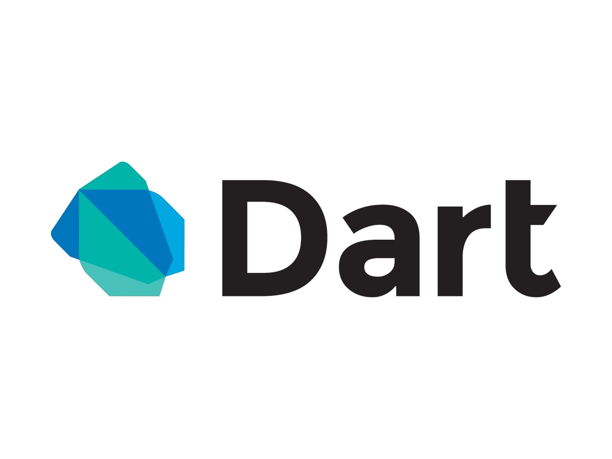

<p align="center">
  
</p>


# Tutorial Básico de Dart

## Introducción

Dart es un lenguaje de programación optimizado para el desarrollo de aplicaciones multiplataforma de alto rendimiento. Es desarrollado por Google y se utiliza para construir aplicaciones móviles, de escritorio, backend y web. Este tutorial cubrirá algunos conceptos básicos para empezar con Dart.

## Instalación del SDK de Dart

Para comenzar con Dart, primero necesitas instalar el SDK (Software Development Kit). El SDK de Dart incluye las herramientas necesarias para desarrollar aplicaciones con Dart.

1. Visita la página oficial de Dart: [Get the Dart SDK](https://dart.dev/get-dart).
2. Sigue las instrucciones específicas para tu sistema operativo (Windows, macOS, Linux).

## Hola Mundo en Dart

El programa "Hola Mundo" es un clásico punto de partida en cualquier lenguaje de programación. Aquí te mostramos cómo escribirlo en Dart:

1. Abre tu editor de texto o IDE preferido.
2. Crea un nuevo archivo y nómbralo `hola_mundo.dart`.
3. Copia y pega el siguiente código:

    ```dart
    void main() {
      print('Hola, Mundo!');
    }
    ```

4. Guarda el archivo.

## Ejecutar tu Programa

Para ejecutar tu programa "Hola Mundo", sigue estos pasos:

1. Abre una terminal o línea de comandos.
2. Navega hasta el directorio donde guardaste `hola_mundo.dart`.
3. Ejecuta el programa con el siguiente comando:

    ```bash
    dart run hola_mundo.dart
    ```

Deberías ver el mensaje "Hola, Mundo!" impreso en la terminal.

## Conceptos Básicos de Dart

Dart es un lenguaje de programación de tipado estático que soporta tanto la compilación AOT (Ahead Of Time) como JIT (Just In Time), lo que lo hace excepcionalmente rápido. Aquí algunos conceptos básicos:

- **Variables:** Dart infiere el tipo de datos de las variables, pero también puedes especificarlos explícitamente.

    ```dart
    var nombre = 'Juan'; // Inferido como String
    String apellido = 'Pérez'; // Especificado explícitamente
    ```

- **Funciones:** Dart es un lenguaje orientado a objetos, y las funciones son un bloque fundamental.

    ```dart
    void saludo(String nombre) {
      print('Hola, $nombre');
    }
    ```

- **Clases:** Dart utiliza clases para la programación orientada a objetos (POO).

    ```dart
    class Persona {
      String nombre;
      
      Persona(this.nombre);
      
      void decirHola() {
        print('Hola, $nombre');
      }
    }
    ```

## Conclusión

Este tutorial te proporciona una introducción básica a Dart. Hay mucho más que aprender sobre Dart, incluyendo características avanzadas y su ecosistema de desarrollo. Te animamos a explorar la [documentación oficial de Dart](https://dart.dev/guides) para profundizar tus conocimientos.

